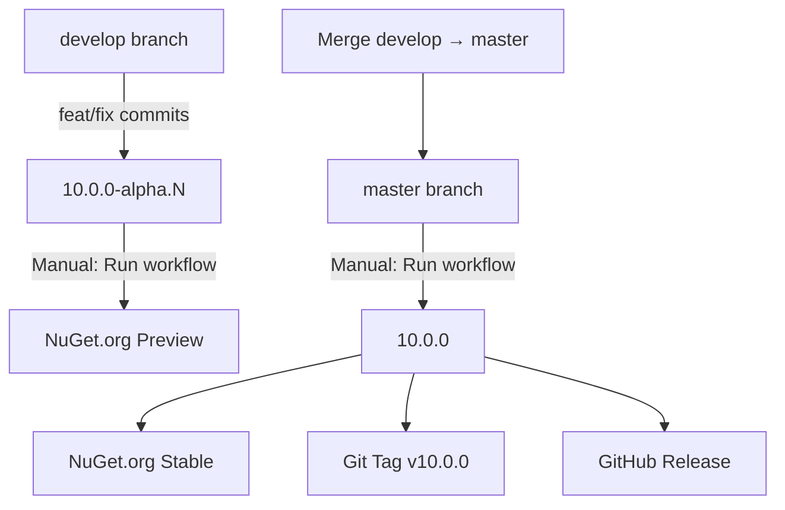

# Release Process

Dieses Projekt nutzt **GitVersion** für automatische Versionierung und **GitHub Actions** für NuGet-Releases.

## Versionsschema

- **`master` Branch**: Stabile Releases → `10.0.x` (z.B. `10.0.0`, `10.0.1`)
- **`develop` Branch**: Alpha/Preview → `10.0.x-alpha.N` (z.B. `10.0.0-alpha.42`)

## Voraussetzungen

### NuGet API Key einrichten

1. Erstelle einen API Key auf [nuget.org](https://www.nuget.org/account/apikeys)
2. Füge ihn als GitHub Secret hinzu:
   - Gehe zu: **Repository → Settings → Secrets and variables → Actions**
   - Klicke: **New repository secret**
   - Name: `NUGET_API_KEY`
   - Value: Dein NuGet API Key

## Release erstellen

### 1. Alpha/Preview Release (develop)

```bash
# Auf develop branch
git checkout develop

# Änderungen committen
git commit -m "feat: new feature"  # → erhöht Minor-Version
# oder
git commit -m "fix: bug fix"       # → erhöht Patch-Version

# Push
git push origin develop
```

**Manueller Release via GitHub UI:**

1. Gehe zu: **Actions → Publish to NuGet.org**
2. Klicke: **Run workflow**
3. Branch: `develop`
4. Optional: Grund eingeben
5. Klicke: **Run workflow**

➡️ **Ergebnis**: `10.0.x-alpha.N` wird auf NuGet.org gepusht

---

### 2. Stable Release (master)

```bash
# Merge develop → master
git checkout master
git merge develop

# Push
git push origin master
```

**Manueller Release via GitHub UI:**

1. Gehe zu: **Actions → Publish to NuGet.org**
2. Klicke: **Run workflow**
3. Branch: `master`
4. Optional: Grund eingeben
5. Klicke: **Run workflow**

➡️ **Ergebnis**: 
- `10.0.x` wird auf NuGet.org gepusht
- Git Tag `v10.0.x` wird erstellt
- GitHub Release wird erstellt

---

## Semantic Versioning (SemVer)

Commit-Nachrichten steuern die Versionierung:

| Commit Message Prefix | Version Bump | Beispiel |
|-----------------------|--------------|----------|
| `fix:` | Patch | `10.0.0` → `10.0.1` |
| `feat:` | Minor | `10.0.0` → `10.1.0` |
| `BREAKING CHANGE:` oder `+semver: major` | Major | `10.0.0` → `11.0.0` |

**Beispiele:**

```bash
git commit -m "fix: resolve null reference in HttpClient"
# → 10.0.0 → 10.0.1

git commit -m "feat: add support for PATCH endpoints"
# → 10.0.0 → 10.1.0

git commit -m "feat!: remove deprecated API
BREAKING CHANGE: removed old fluent API"
# → 10.0.0 → 11.0.0
```

---

## Workflow-Übersicht



---

## Troubleshooting

### "NuGet API Key not found"
- Prüfe, ob das Secret `NUGET_API_KEY` existiert
- Stelle sicher, dass der API Key nicht abgelaufen ist

### Version wird nicht erhöht
- Prüfe Commit-Message-Format (muss `feat:`, `fix:`, etc. enthalten)
- Siehe: [Conventional Commits](https://www.conventionalcommits.org/)

### Tests schlagen fehl
- WriteSnapshot-Tests benötigen **Debug-Build** (automatisch im Workflow)
- Lokal: `dotnet test --configuration Debug`

---

## Links

- **NuGet Package**: https://www.nuget.org/packages/AspNetCore.Simple.MsTest.Sdk
- **GitHub Releases**: https://github.com/RenePeuser/AspNetCore.Simple.MsTest.Sdk/releases
- **GitVersion Docs**: https://gitversion.net/docs/
