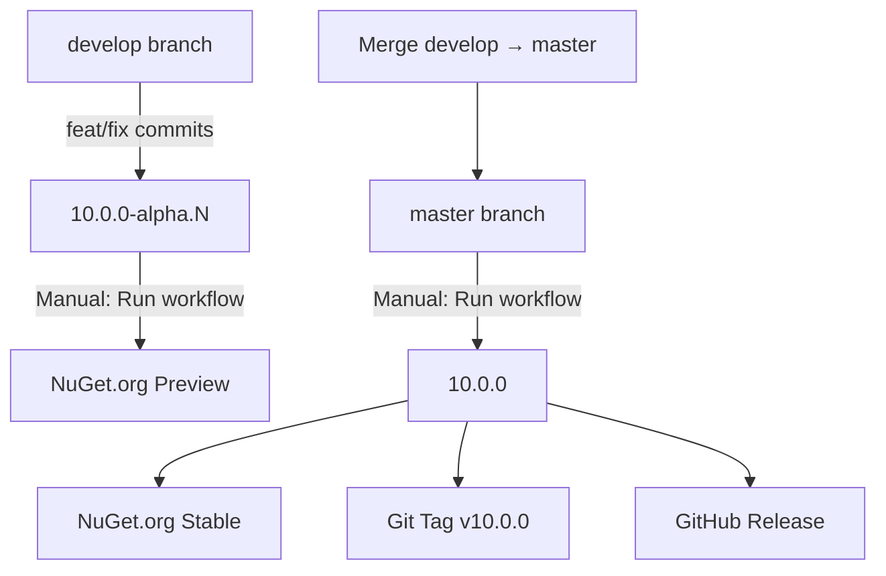

# Release Process

Dieses Projekt nutzt **GitVersion** für automatische Versionierung und **GitHub Actions** für NuGet-Releases.

## Versionsschema

- **`master` Branch**: Stabile Releases → `10.0.x` (z.B. `10.0.0`, `10.0.1`)
- **`develop` Branch**: Alpha/Preview → `10.0.x-alpha.N` (z.B. `10.0.0-alpha.42`)

## Voraussetzungen

### Trusted Publisher auf NuGet.org einrichten

Dieses Projekt nutzt **Trusted Publishers** (OIDC) - keine API Keys mehr nötig! 🔐

**Einmalige Einrichtung:**

1. Gehe zu [nuget.org](https://www.nuget.org) und melde dich an
2. Navigiere zu deinem Package (oder reserviere den Namen):
   - https://www.nuget.org/packages/manage/upload
3. **Bei bestehendem Package:**
   - Gehe zu: **Package → Trusted publishers**
   - Klicke: **Add trusted publisher**
4. **Bei neuem Package:**
   - Klicke: **Reserve prefix** und folge dem Wizard
5. **Trusted Publisher konfigurieren:**
   - **Repository owner**: `RenePeuser`
   - **Repository name**: `AspNetCore.Simple.MsTest.Sdk`
   - **Workflow name**: `publish.yml`
   - **Environment** (optional): leer lassen
6. Klicke: **Register**

✅ **Fertig!** GitHub Actions kann jetzt direkt über OIDC publishen - ohne API Keys!

## Release erstellen

### 1. Alpha/Preview Release (develop)

```bash
# Auf develop branch
git checkout develop

# Änderungen committen
git commit -m "feat: new feature"  # → erhöht Minor-Version
# oder
git commit -m "fix: bug fix"       # → erhöht Patch-Version

# Push
git push origin develop
```

**Manueller Release via GitHub UI:**

1. Gehe zu: **Actions → Publish to NuGet.org**
2. Klicke: **Run workflow**
3. Branch: `develop`
4. Optional: Grund eingeben
5. Klicke: **Run workflow**

➡️ **Ergebnis**: `10.0.x-alpha.N` wird auf NuGet.org gepusht

---

### 2. Stable Release (master)

```bash
# Merge develop → master
git checkout master
git merge develop

# Push
git push origin master
```

**Manueller Release via GitHub UI:**

1. Gehe zu: **Actions → Publish to NuGet.org**
2. Klicke: **Run workflow**
3. Branch: `master`
4. Optional: Grund eingeben
5. Klicke: **Run workflow**

➡️ **Ergebnis**: 
- `10.0.x` wird auf NuGet.org gepusht
- Git Tag `v10.0.x` wird erstellt
- GitHub Release wird erstellt

---

## Semantic Versioning (SemVer)

Commit-Nachrichten steuern die Versionierung:

| Commit Message Prefix | Version Bump | Beispiel |
|-----------------------|--------------|----------|
| `fix:` | Patch | `10.0.0` → `10.0.1` |
| `feat:` | Minor | `10.0.0` → `10.1.0` |
| `BREAKING CHANGE:` oder `+semver: major` | Major | `10.0.0` → `11.0.0` |

**Beispiele:**

```bash
git commit -m "fix: resolve null reference in HttpClient"
# → 10.0.0 → 10.0.1

git commit -m "feat: add support for PATCH endpoints"
# → 10.0.0 → 10.1.0

git commit -m "feat!: remove deprecated API
BREAKING CHANGE: removed old fluent API"
# → 10.0.0 → 11.0.0
```

---

## Workflow-Übersicht



---

## Troubleshooting

### "The repository is not trusted by the package owner"
- Prüfe, ob der Trusted Publisher korrekt auf NuGet.org konfiguriert ist
- Stelle sicher, dass Repository Owner, Name und Workflow exakt übereinstimmen
- Warte einige Minuten nach der Registrierung

### Erstes Release schlägt fehl
- Beim **ersten Release** musst du das Package manuell über nuget.org hochladen
- Danach funktioniert Trusted Publishers für alle weiteren Updates
- Alternativ: API Key temporär nutzen für den ersten Upload

### Version wird nicht erhöht
- Prüfe Commit-Message-Format (muss `feat:`, `fix:`, etc. enthalten)
- Siehe: [Conventional Commits](https://www.conventionalcommits.org/)

### Tests schlagen fehl
- WriteSnapshot-Tests benötigen **Debug-Build** (automatisch im Workflow)
- Lokal: `dotnet test --configuration Debug`

---

## Links

- **NuGet Package**: https://www.nuget.org/packages/AspNetCore.Simple.MsTest.Sdk
- **GitHub Releases**: https://github.com/RenePeuser/AspNetCore.Simple.MsTest.Sdk/releases
- **GitVersion Docs**: https://gitversion.net/docs/
- **NuGet Trusted Publishers**: https://devblogs.microsoft.com/nuget/introducing-package-source-mapping-and-package-source-authentication/

---

## ℹ️ Warum Trusted Publishers?

**Vorteile gegenüber API Keys:**
- ✅ Keine Secrets im Repository nötig
- ✅ OIDC-basierte Authentifizierung direkt über GitHub
- ✅ Nur der konfigurierte Workflow kann publishen
- ✅ Automatische Rotation - keine abgelaufenen Keys
- ✅ Audit-Trail auf NuGet.org
